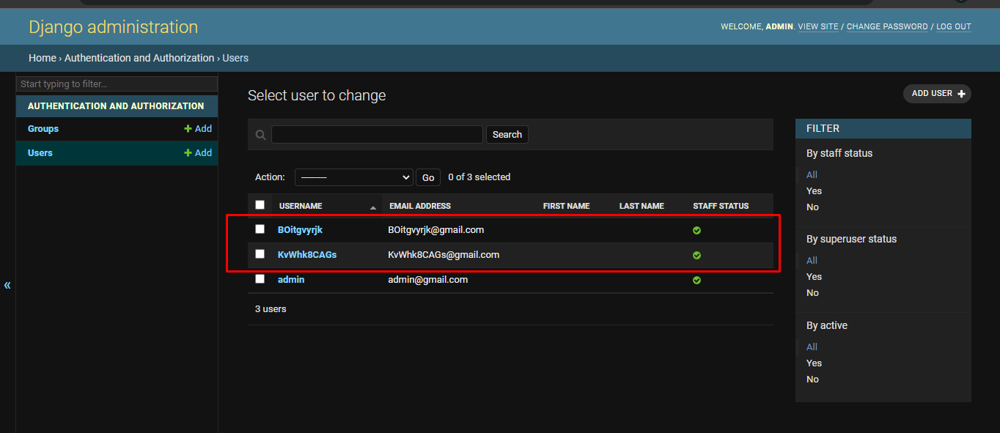

#### Project layout

    custom-command
    |
    |------Core
    |	 |
    |	 |----- __pycache__
    |	 |----- __init__.py
    |	 |----- asgi.py
    |	 |----- setting.py
    |	 |----- urls.py
    |	 |----- wsgi.py 
    |
    |------custom_command
    |	           |
    |	           |----------------- __pycache__
    |	           |----------------- management
    |	           |                          |
    |	           |	                      |
    |	           |----- migrations 	      |-----commands 
    |	           |	   |----__pycache__   |	    |----- __pycache__
    |	           |	   |----__init__.py   |	    |----- namegen.py 
    |	           |	                      |	    |----- usergen.py 
    |	           |----- __init__.py 	      
    |	           |----- admin.py 	                        
    |	           |----- apps.py 
    |	           |----- models.py 
    |              |----- tests.py 
    |              |----- views.py 
    |
    |------db.sqlite3
    |------manage.py

### #1 
###### Auto name generator :
    py manage.py namegen

output: 

    -----------New name---------- 
    Name: yVXAPErgG7mMvum
    name Generate Succesfully Completed!

    Mail Name

    Todd Beasley
    John Taylor
    Kelly Broome
    William Mattione
    Christopher Kridler
    Daren Goodwin
    Earnest Reed
    Richard Robinson
    Robert Carver
    Dennis Oliver
    James Sorensen
    Thad Souther
    Edward Carper
    Mark Muzzey
    Joshua Collier

    Femail Name

    Rebecca Keller
    Melissa Pastian
    Gerda Roof
    Edith Warren
    Jane Hopkins
    Sonia Derringer
    Lindsay Jones
    Astrid Lipscomb
    Margaret Crum
    Cari Sorenson
    Amanda Blaschke
    Rebecca Moore
    Melissa Kemp
    Debbie Daniels
    Amber West

### #2 
#### Auto User Create : 

###### Auto user generator Command:
    py manage.py usergen 1

note: ( usergen 1) Here 1 is the quantity

###output 
    ===========New User========== 
    username: bdrtL3m5PW
    email: bdrtL3m5PW@gmail.com
    password : 2uEtdGsMP5
    account created Succesfully Completed!

or Create user with full access permissions

        py manage.py usergen 2 -a

### output: 

